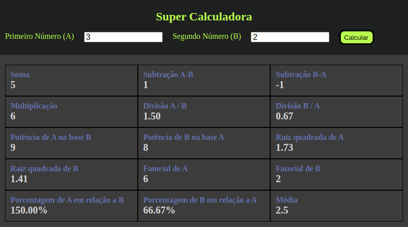

# Minicamp_XPE_Programacao_Basica
Projetos Realizados Durante o Minicamp de Programação Básica Ofertado pela XPE Utilizando HTML, CSS e JavaScript.

- Currículo V1: [Código Fonte](https://github.com/vinitg96/Minicamp_XPE_Programacao_Basica/tree/main/curriculo-v1)
- Currículo V2: [Código Fonte](https://github.com/vinitg96/Minicamp_XPE_Programacao_Basica/tree/main/curriculo-v2)
- Super Calculadora (Preview abaixo): [Código Fonte](https://github.com/vinitg96/Minicamp_XPE_Programacao_Basica/tree/main/super_calculadora) | [Web Site](https://super-calculadora-xpe-vinicius.netlify.app/)

